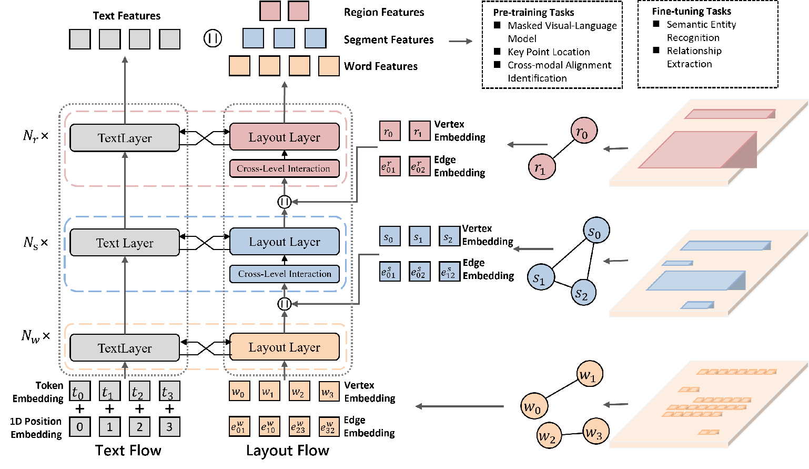

# GraphMLLM

This is the official PyTorch implementation of the ICDAR 2024 paper: "GraphMLLM: A Graph-based Multi-level Layout Language-independent Model for Document Understanding"



## Installation
```
conda create -n gmllm python=3.9
conda activate gmllm
conda install pytorch==1.12.1 torchvision==0.13.1 
cudatoolkit=11.3 -c pytorch
git clone https://github.com/HSDai/GraphMLLM
cd GraphMLLM
pip install -r requirements.txt
pip install -e .
```

## Datasets

In this repository, we provide the fine-tuning codes for [FUNSD](https://guillaumejaume.github.io/FUNSD/) and [XFUND](https://github.com/doc-analysis/XFUND). 

## Available Checkpoints
https://1drv.ms/f/s!Amd7R8F_GM_NblGPlVdps7-jzFk?e=2aoD5f

## Generate Your Own Checkpoint (Optional)
If you want to combine the pre-trained GraphMLLM with **other language's *RoBERTa***, please download  `gmllm-only-base` and use `gen_weight_roberta_like.py` to generate your own pre-trained checkpoint.

## Fine-tuning

### Semantic Entity Recognition on FUNSD

```
CUDA_VISIBLE_DEVICES=0 python -m torch.distributed.launch --nproc_per_node=1 examples/run_funsd.py \
        --model_name_or_path gmllm-roberta-en-base \
        --tokenizer_name roberta-base \
        --output_dir ser_funsd_gmllm-roberta-en-base \
        --do_train \
        --do_predict \
        --max_steps 5000 \
        --per_device_train_batch_size 32 \
        --warmup_ratio 0.1 \
        --fp16
```

### Language-specific (For example, ZH) Semantic Entity Recognition on XFUND

```
CUDA_VISIBLE_DEVICES=0,1,2,3 python -m torch.distributed.launch --nproc_per_node=4 examples/run_xfun_ser.py \
        --model_name_or_path gmllm-infoxlm-base \
        --tokenizer_name xlm-roberta-base \
        --output_dir ser_xfund_zh_gmllm-infoxlm-base \
        --do_train \
        --do_eval \
        --lang zh \
        --max_steps 5000 \
        --per_device_train_batch_size 8 \
        --learning_rate  1e-5 \
        --warmup_ratio 0.1 \
        --fp16
```

### Language-specific (For example, ZH) Relation Extraction on XFUND

```
CUDA_VISIBLE_DEVICES=0,1,2,3 python -m torch.distributed.launch --nproc_per_node=4 examples/run_xfun_re.py \
        --model_name_or_path gmllm-infoxlm-base \
        --tokenizer_name xlm-roberta-base \
        --output_dir ls_re_xfund_zh_gmllm-infoxlm-base \
        --do_train \
        --do_eval \
        --lang zh \
        --max_steps 5000 \
        --per_device_train_batch_size 8 \
        --learning_rate  1e-5 \
        --warmup_ratio 0.1 \
        --fp16
```

### Multi-task Semantic Entity Recognition on XFUND

```
CUDA_VISIBLE_DEVICES=0,1,2,3 python -m torch.distributed.launch --nproc_per_node=4 examples/run_xfun_ser.py \
        --model_name_or_path gmllm-infoxlm-base \
        --tokenizer_name xlm-roberta-base \
        --output_dir mt_ser_xfund_all_gmllm-infoxlm-base \
        --do_train \
        --additional_langs all \
        --max_steps 16000 \
        --per_device_train_batch_size 16 \
        --warmup_ratio 0.1 \
        --fp16
```

### Multi-task Relation Extraction on XFUND

```
CUDA_VISIBLE_DEVICES=0,1,2,3 python -m torch.distributed.launch --nproc_per_node=4 examples/run_xfun_re.py \
        --model_name_or_path gmllm-infoxlm-base \
        --tokenizer_name xlm-roberta-base \
        --output_dir mt_re_xfund_all_gmllm-infoxlm-base \
        --do_train \
        --additional_langs all \
        --max_steps 40000 \
        --per_device_train_batch_size 8 \
        --learning_rate  6.25e-6 \
        --warmup_ratio 0.1 \
        --fp16
```

## Acknowledge

The repository benefits greatly from [LiLT](https://github.com/jpWang/LiLT). Thanks a lot for their excellent work.
